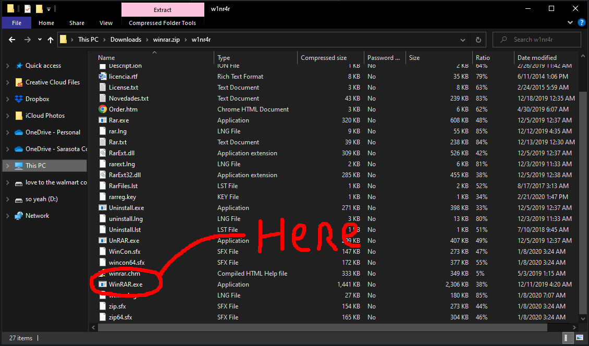

# 🔨 How to install

## You'll need [WinRAR](../download-links/winrar.md) and whatever you want to open/use/play (as of codename: Fontaine)

If you are here is because you have downloaded everything that you need, or wanna play, at least, here I will guide you to the process of the installation of the files/games.

***

## If you have WinRAR installed, go to the [next page.](how-to-run-programs-that-normally-wont-run..md)

***

**First,** you need to go to your downloads on chrome/edge, should be at the top right corner of the screen or down left **(quick shortcut Ctrl + J)** [or click here.](chrome://downloads)

**Find WinRAR.**

<figure><figcaption>
Here's on the recent's downloads
</figcaption></figure>

<figure><figcaption>
Here's on the downloads menu
</figcaption></figure>

Then, you open that file, you should see this.

<figure><figcaption>
It opens file explorer.
</figcaption></figure>

After that, you need to open that folder, and then find the .exe that is called **"WinRAR.exe"**.

<figure><figcaption>
Should be all the way down.
</figcaption></figure>

After that, a window will pop up, you will hit **"Run"**

<figure><figcaption>
The middle one.
</figcaption></figure>

After that, WinRAR will open and you will have winrar semi-installed on the system you did this!

<figure><figcaption>
WinRAR should look like this.
</figcaption></figure>

To **completely** install winrar, you need to right click on the icon in the taskbar, looks like the one in the image below, and hit **"Pin to Taskbar"**

<figure><figcaption>
This will simplify everything.
</figcaption></figure>

### And you are done with (probably) the hardest part of the installation!

## [Go to the next page to see how to run programs and continue with the installation.](how-to-run-programs-that-normally-wont-run..md)
