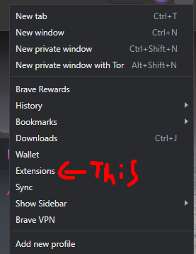

# 📏 How to install extensions on another browser

You can find unpacked extensions on [extensions](../extensions/ "mention").

***

First, go to your browser of preference, in this case, we're gonna use Brave. (Should be the same for others as well)

Then, go to the right top options button, this can be either 3-dots or 3-bars

<figure><figcaption>
Google Chrome
</figcaption></figure>

<figure><figcaption>
Brave
</figcaption></figure>

<figure><figcaption>
Microsoft Edge
</figcaption></figure>

After that, go to "Extensions", and then, enable developer mode.

&#x20;

<figure><figcaption>
Extensions button
</figcaption></figure>

<figure><figcaption>
This should be on.
</figcaption></figure>

After that, you should see two more options, one being "Load Unpacked" and "Pack Extension"

<figure><figcaption></figcaption></figure>

Then, you're gonna grab the extension(s) you [downloaded](../extensions/), and drag it to the extensions tab, in this case, on Brave.

<figure><figcaption></figcaption></figure>

After that you should be able to use your extension(s) just fine!&#x20;
