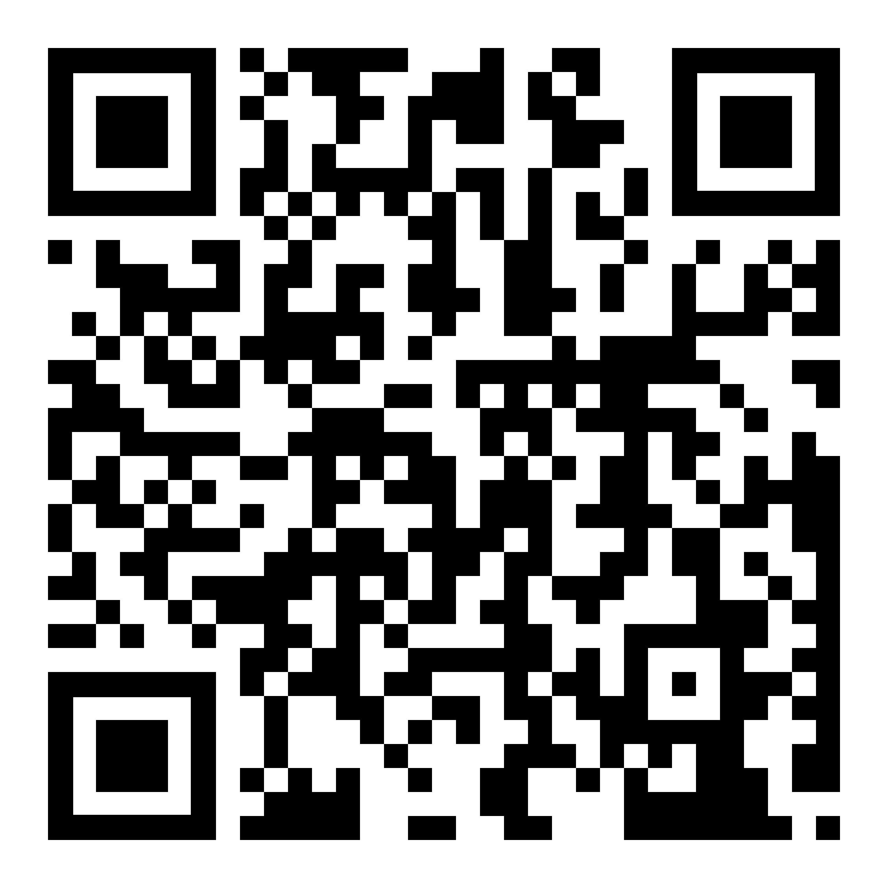
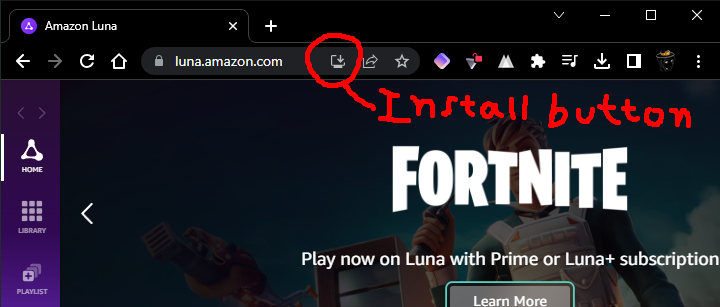

# 🌙 Amazon Luna Tutorial


## You just go to [luna.amazon.com](https://luna.amazon.com) to see if it is unblocked (should be), if its not, you can go to [luna proxied](https://ub.cantv.us/uv/service/hvtrs8%2F-lwnc.cmczmn%2Ccmm-), but you will have a lot of imput lag.


***


## You need an Amazon Prime membership or Luna+ subscription [(you can share Prime between two accounts)](../list-of-websites/share-amazon-prime.md)


***

For Fortnite and Rainbow Six Siege, it may ask you to link your account, you need to do this in your mobile device, or any network that lets you sign in into [epicgames.com](https://epicgames.com/id/login)/[ubisoftconnect.com](https://ubisoftconnect.com/).

#### Scan the following QR Code and login into your amazon account that you wanna play Fortnite/RS6 on.

<figure><figcaption>
<a href="https://luna.amazon.com/settings?subNav=linked_accounts">https://luna.amazon.com/settings?subNav=linked_accounts</a>
</figcaption></figure>

After you succesfully link you epic/ubisoft account, you can now play the games you want without downloading anything! You can play with controller or keyboard and mouse.

***

## For optimal performance/minor imput lag, install the website as an app, theres a button next to the share button to do that.

<figure><figcaption>
After that, you are basically done.
</figcaption></figure>
