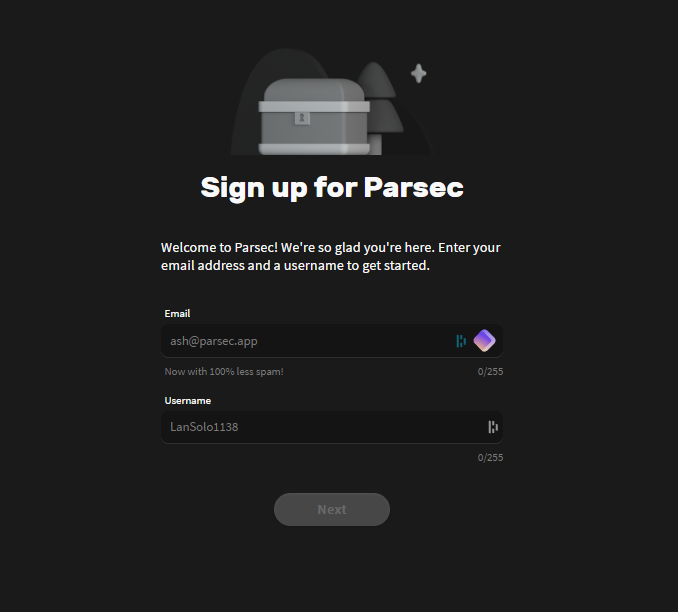

# 📶 Parsec (Host)

Make an account [here](https://dash.parsec.app/signup/), this is the account you will use on school computers as well.

<figure><figcaption>
The page should look like this
</figcaption></figure>

After that, download parsec on your main computer, either from [my link](../download-links/parsec.md) or their [official link.](https://parsec.app/downloads)

<figure><figcaption>
Download page
</figcaption></figure>

After you download the parsec setup, open it, it should look like this:

<figure><figcaption>
Enable "Virtual Display Driver" for a better experience.
</figcaption></figure>

Click "Next" and hit "Shared" this will let you log in into parsec even if your computer is on sleep mode.\

<figure><figcaption></figcaption></figure>

Hit "Next" and then, open parsec.

After you open parsec, you need to put the account you made.

<figure><figcaption></figcaption></figure>

After you put your account, hit "Refresh" and your computer should be ready!

In the school computer, go to the [parsec website](https://web.parsec.app) or download the app from [here](../download-links/parsec.md).

Login into the same account that you put on your computer, and then, connect, and you should be able to connect no issues!
